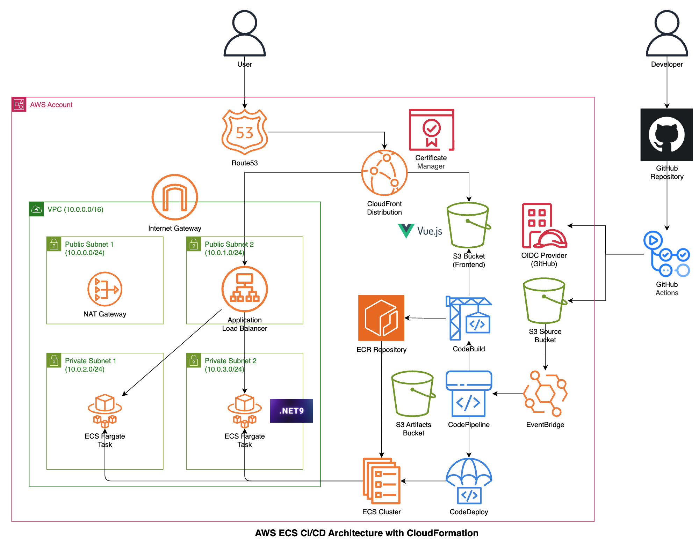

# AWS ECS CI/CD Project

このプロジェクトは、AWS ECS（Elastic Container Service）を使用したCI/CDパイプラインを構築するためのインフラストラクチャとアプリケーションコードを含んでいます。

## プロジェクト構成

- **cfn/**: CloudFormationテンプレートとデプロイメント設定
- **src/**: アプリケーションソースコード
  - **backend/**: .NET 9.0 Web API
  - **frontend/**: Vue.js 3アプリケーション

## アーキテクチャ

### インフラ

このプロジェクトでは、以下のAWSリソースを使用してCI/CDパイプラインを構築します：

- 0. **ECR** - Dockerイメージレジストリ
- 1. **Network** - VPC、サブネット、セキュリティグループ
- 2. **Backend** - ECS タスクとサービス（Backend API）
- 3. **Frontend** - ECS タスクとサービス（Frontend）
- 4. **CDN** - CloudFront配信
- 8. **Pipeline** - CodePipelineによるCI/CD自動化
- 9. **OIDC** - GitHub Actionsとの連携（OIDCプロバイダ）



### アプリケーション

アプリケーションは、以下の構造で実装されています。
- backend ... WebAPI by .net 9
- frontend ... Static web site by Vue.js

## 前提条件

- AWS CLI設定済み
- Docker
- .NET 9.0 SDK
- Node.js と npm

## デプロイメント

### 1. CloudFormationスタックの作成

CloudFormationテンプレートを順次デプロイします：

```bash
cd cfn

# ECRレジストリの作成
aws cloudformation create-stack --stack-name ecscicd-ecr \
    --template-body file://template/0.ecr.yaml \
    --capabilities CAPABILITY_NAMED_IAM \
    --region ap-northeast-1

# ネットワークの作成
aws cloudformation create-stack --stack-name ecscicd-network \
    --template-body file://template/1.network.yaml \
    --capabilities CAPABILITY_NAMED_IAM \
    --region ap-northeast-1

# バックエンドの作成
aws cloudformation create-stack --stack-name ecscicd-backend \
    --template-body file://template/2.backend.yaml \
    --capabilities CAPABILITY_NAMED_IAM \
    --region ap-northeast-1

# フロントエンドの作成
aws cloudformation create-stack --stack-name ecscicd-frontend \
    --template-body file://template/3.frontend.yaml \
    --capabilities CAPABILITY_NAMED_IAM \
    --region ap-northeast-1

# CDNの作成
aws cloudformation create-stack --stack-name ecscicd-cdn \
    --template-body file://template/4.cdn.yaml \
    --capabilities CAPABILITY_NAMED_IAM \
    --region ap-northeast-1 \
    --parameters file://parameter/parameter_cdn.json

# パイプラインの作成
aws cloudformation create-stack --stack-name ecscicd-pipeline \
    --template-body file://template/9.pipeline.yaml \
    --capabilities CAPABILITY_NAMED_IAM \
    --region ap-northeast-1
```

### 2. ローカル開発

#### バックエンド開発

```bash
cd src/backend
dotnet restore
dotnet run
```

#### フロントエンド開発

```bash
cd src/frontend
npm install
npm run dev
```

## 技術スタック

- **Backend**: .NET 9.0, ASP.NET Core Web API
- **Frontend**: Vue.js 3, Vite
- **Infrastructure**: AWS CloudFormation, ECS, ECR, CloudFront
- **CI/CD**: AWS CodePipeline, CodeBuild

## ファイル構成

```
aws_ecs_cicd/
├── cfn/
│   ├── command.md                     # CloudFormationコマンド集
│   ├── parameter/
│   │   └── parameter_cdn.json         # CDNパラメータ
│   └── template/
│       ├── 0.ecr.yaml                 # ECRテンプレート
│       ├── 1.network.yaml             # ネットワークテンプレート
│       ├── 2.backend.yaml             # バックエンドテンプレート
│       ├── 3.frontend.yaml            # フロントエンドテンプレート
│       ├── 4.cdn.yaml                 # CDNテンプレート
│       ├── 8.pipeline.yaml            # パイプラインテンプレート
│       └── 9.oidc_from_github.yaml    # OIDCプロバイダテンプレート
└── src/
    ├── backend/
    │   ├── Dockerfile
    │   ├── Program.cs
    │   ├── backend.csproj
    │   └── buildspec.yml
    └── frontend/
        ├── package.json
        ├── vite.config.js
        ├── buildspec.yml
        └── src/
            ├── App.vue
            └── main.js
```

## 更新とメンテナンス

スタックの更新は `cfn/command.md` の「Update stack」セクションのコマンドを使用してください。

## 注意事項

- デプロイメントはap-northeast-1リージョンで実行されます
- 各スタックは依存関係があるため、番号順にデプロイしてください
- CDNスタックにはパラメータファイルが必要です